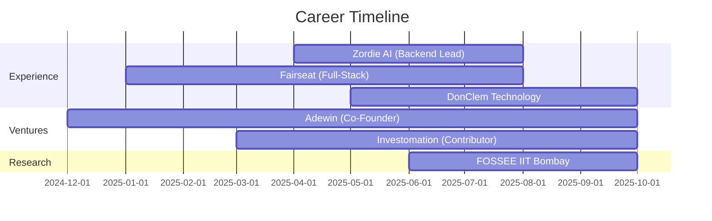

<div align="center">

# 👋 Hey, I'm Pavan Kumar


<p>
  <a href="https://linkedin.com/in/simhadri-pavan-kumar-14b87027b/"></a>
  <a href="mailto:pavankumarsimhadri987@gmail.com"></a>
  <a href="https://github.com/pavannani99"></a>
  
</p>

</div>

---

## 🚀 About Me

```typescript
const pavan = {
    role: "Full-Stack Developer & Backend Architect",
    location: "Hyderabad, India 🇮🇳",
    currentFocus: ["Microservices Architecture", "AI Integration", "Scalable Systems"],
    
    ventures: {
        coFounder: "Adewin (AI-Powered AdTech)",
        contributing: "Investomation (Real Estate Analytics)",
        research: "FOSSEE IIT Bombay (CFD Simulations)"
    },
    
    workExperience: [
        { company: "Zordie AI", role: "Backend Lead", achievement: "15+ APIs, 45% performance boost" },
        { company: "Fairseat", role: "Full-Stack Dev", achievement: "Complete Auth System" },
        { company: "DonClem", role: "Full-Stack Dev", achievement: "60% faster load times" }
    ],
    
    achievements: [
        "🏆 Top 1% - Outlier AI Hackathon (500+ participants)",
        "🌟 1000+ LOC merged - GSSoC 2024",
        "💪 100+ LeetCode problems (85% medium/hard)",
        "🚀 Promoted to Backend Lead in 4 months"
    ],
    
    openToWork: true,
    coffee: "☕".repeat(Math.floor(Math.random() * 5) + 1)
};
```

---

## 💻 Tech Arsenal

<div align="center">

### Core Languages


### Frontend Mastery


### Backend Excellence


### Database Systems


### Cloud & DevOps


### AI/ML Stack


</div>

---

## 🎯 Featured Work

<div align="center">
<table>
<tr>
<td width="50%">

### 🎨 Adewin
**AI-Powered AdTech Startup**

*Co-Founder & Backend Architect*

```yaml
Tech: FastAPI, Python, PostgreSQL, GPT
Impact: SMB campaign generation in minutes
Status: MVP ✅ | Seeking Investment 💰
```

**Key Features:**
- LLM-powered prompt generation
- Automated data cleaning workflows
- Scalable REST API architecture

</td>
<td width="50%">

### 🏘️ Investomation
**Real Estate Analytics Platform**

*Backend Developer (Mentor: Alexander Tspekov)*

```yaml
Tech: Svelte, Node.js, Express, SQLite
Scale: 300+ GB data processing
Sources: Census, IRS, Zillow, Redfin
```

**Key Features:**
- Microservices architecture
- Layered data processing engine
- Real-time neighborhood profiling

</td>
</tr>

<tr>
<td width="50%">

### 💬 EduConnect
**Real-Time Collaboration Platform**

```yaml
Tech: React, Firebase, WebSockets
Users: 200+ concurrent
Latency: <200ms chat response
```

**Key Features:**
- Real-time chat & file sharing
- Role-based access control (RBAC)
- JWT authentication system

</td>
<td width="50%">

### 🔬 FOSSEE OpenFOAM
**CFD Simulation Research**

*IIT Bombay Internship*

```yaml
Tech: OpenFOAM, Python
Selection: Top 100 from 100+
Status: Ongoing Research
```

**Key Features:**
- Computational fluid dynamics
- Simulation automation
- Advanced engineering workflows

</td>
</tr>
</table>
</div>

---

## 📊 GitHub Analytics

<div align="center">
  
  
</div>

<div align="center">
  
</div>

<div align="center">
  
</div>

### 📈 Detailed Statistics

<div align="center">


</div>

### 🎯 Coding Metrics

<div align="center">

<!--START_SECTION:waka-->
<!--END_SECTION:waka-->


</div>

---

## 🏆 Achievements & Badges

<div align="center">

### GitHub Achievements


### Holopin Badges
[](https://holopin.io/@pavannani99)

### Key Accomplishments

| Achievement | Details |
|------------|---------|
| 🥇 **Top 1% Hackathon** | Outlier AI UI Design (500+ participants) |
| 🌟 **GSSoC 2024** | 1,000+ lines of code merged |
| 💪 **LeetCode Master** | 100+ problems solved (85% medium/hard) |
| 🚀 **Fast Track Promotion** | Backend Lead at Zordie AI (4 months) |
| 🎓 **IIT Bombay Research** | FOSSEE OpenFOAM Internship |

</div>

---

## 🔥 More Stats & Visualizations

<div align="center">

### 📅 Commit Calendar


### ⏰ Coding Time Distribution


### 🔝 Most Used Languages (Detailed)


### 📊 Contribution Metrics


### 🎨 3D Contribution Profile


### 💹 Repo Analysis


</div>

---

## 🎮 Fun Extras

<div align="center">

### 🐍 Contribution Snake


### 🎯 GitHub Skyline
[](https://skyline.github.com/pavannani99/2024)

### 🏅 Sponsor Badge
<a href="https://github.com/sponsors/pavannani99"></a>

### 🎪 Random Dev Joke


### 📜 Random Dev Quote


### 🎵 Spotify Playing


### 📚 Latest Blog Posts
<!-- BLOG-POST-LIST:START -->
- [Blog Post 1](#)
- [Blog Post 2](#)
<!-- BLOG-POST-LIST:END -->

### 🎥 Latest YouTube Videos
<!-- YOUTUBE:START -->
<!-- YOUTUBE:END -->

### 📰 Recent Dev.to Articles
<a href="https://dev.to/pavannani99"></a>

### 💬 Random GitHub Repo


### 🔖 Gists
<a href="https://gist.github.com/pavannani99"></a>

### 📦 NPM Packages
<a href="https://www.npmjs.com/~pavannani99"></a>

### 🐳 Docker Hub
<a href="https://hub.docker.com/u/pavannani99"></a>

</div>

---

## 🌐 Web Presence

<div align="center">

### 🔗 All Links
<a href="https://linktr.ee/pavannani99"></a>

### 💼 Other Platforms
[](https://stackoverflow.com/users/yourid)
[](https://medium.com/@pavannani99)
[](https://hashnode.com/@pavannani99)
[](https://twitter.com/pavannani99)
[](https://reddit.com/u/pavannani99)

### 🎓 Learning Platforms
[](https://coursera.org/user/yourid)
[](https://udemy.com/user/pavannani99)
[](https://app.pluralsight.com/profile/pavannani99)

</div>

---

## 🎁 Support My Work

<div align="center">

### ☕ Buy Me a Coffee
<a href="https://www.buymeacoffee.com/pavannani99"></a>

### 💖 GitHub Sponsors
<a href="https://github.com/sponsors/pavannani99"></a>

### ₿ Crypto Support
**BTC:** `your_btc_address`  
**ETH:** `your_eth_address`

</div>

<div align="center">



</div>

---

## 📈 Contribution Graph

<div align="center">


</div>

---

## 🎓 Current Focus Areas

<div align="center">

| Area | Technologies | Status |
|------|-------------|--------|
| 🏗️ **Microservices** | Svelte, Node.js, Docker | 🔥 Active |
| 🤖 **AI Integration** | PyTorch, Transformers, RAG | 🔥 Active |
| ⚡ **Performance** | Redis, PostgreSQL, Optimization | 🔥 Active |
| 🦀 **Systems Programming** | Rust, Go | 📚 Learning |
| 📊 **Real-Time Systems** | WebSockets, Stream Processing | 🔥 Active |

</div>

---

## 💡 Open Source Contributions

<div align="center">

[](https://gssoc.girlscript.tech/)
[](https://github.com/pavannani99)
[](https://github.com/pavannani99)

</div>

---

## 📫 Let's Connect

<div align="center">

**Open to opportunities in:** Backend Development | Full-Stack Engineering | AI/ML Integration | Startup Ventures

<br/>

[](https://linkedin.com/in/simhadri-pavan-kumar-14b87027b/)
[](mailto:pavankumarsimhadri987@gmail.com)
[](https://github.com/pavannani99)

</div>

---

<div align="center">

### 💭 *"Code is like humor. When you have to explain it, it's bad."* – Cory House

<br/>

**⭐ From [pavannani99](https://github.com/pavannani99) with 💙**

<br/>


</div>
