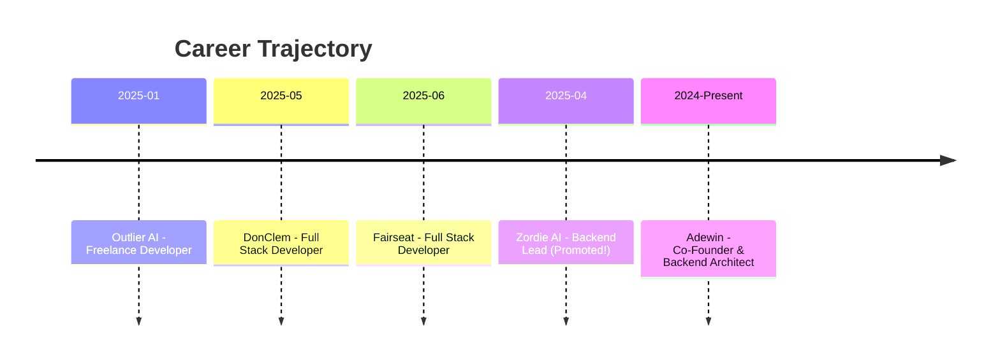

<div align="center">


</div>

<div align="center">

### 🚀 Backend Lead @ Zordie AI | Co-Founder @ Adewin

[](https://git.io/typing-svg)

<p align="center">
  <a href="https://linkedin.com/in/pavan-nani">
    
  </a>
  <a href="mailto:pavankumarsimhadri987@gmail.com">
    
  </a>
  <a href="https://leetcode.com/u/pavankumarsimhadri987/">
    
  </a>
  <a href="https://github.com/pavannani99">
    
  </a>
</p>


</div>

---

## 💼 Currently Building

<table>
<tr>
<td width="50%" valign="top">

### 🎨 Adewin - AI AdTech Revolution
**Co-Founder & Backend Architect**


```yaml
stack: FastAPI | Python | PostgreSQL | GPT-4
scale: 100K+ records processed
status: 🚀 MVP Complete - Raising Seed
```

**Impact:**
- 🤖 LLM-powered campaign generation
- ⚡ Auto data cleaning pipelines
- 🔐 Enterprise-grade REST APIs
- 💰 Built for SMB scalability

</td>
<td width="50%" valign="top">

### 🏘️ Investomation - Real Estate AI
**Backend Developer**


```yaml
stack: Svelte | Node.js | Express | SQLite
data: 300+ GB multi-source analytics
mentor: Alexander Tspekov
```

**Features:**
- 📊 Real-time neighborhood profiling
- 🔄 Census + IRS + Zillow integration
- 🏗️ Layered microservices architecture
- 🎯 Data correlation engine

</td>
</tr>
</table>

---

## 🛠️ Tech Arsenal

<div align="center">

<table>
<tr>
<td align="center" width="96">
  
  <br>Python
</td>
<td align="center" width="96">
  
  <br>TypeScript
</td>
<td align="center" width="96">
  
  <br>JavaScript
</td>
<td align="center" width="96">
  
  <br>C++
</td>
<td align="center" width="96">
  
  <br>Go
</td>
<td align="center" width="96">
  
  <br>React
</td>
<td align="center" width="96">
  
  <br>Next.js
</td>
<td align="center" width="96">
  
  <br>Svelte
</td>
</tr>
<tr>
<td align="center" width="96">
  
  <br>FastAPI
</td>
<td align="center" width="96">
  
  <br>Django
</td>
<td align="center" width="96">
  
  <br>Node.js
</td>
<td align="center" width="96">
  
  <br>Express
</td>
<td align="center" width="96">
  
  <br>GraphQL
</td>
<td align="center" width="96">
  
  <br>PostgreSQL
</td>
<td align="center" width="96">
  
  <br>MongoDB
</td>
<td align="center" width="96">
  
  <br>Redis
</td>
</tr>
<tr>
<td align="center" width="96">
  
  <br>Docker
</td>
<td align="center" width="96">
  
  <br>AWS
</td>
<td align="center" width="96">
  
  <br>CI/CD
</td>
<td align="center" width="96">
  
  <br>Linux
</td>
<td align="center" width="96">
  
  <br>PyTorch
</td>
<td align="center" width="96">
  
  <br>Firebase
</td>
<td align="center" width="96">
  
  <br>Tailwind
</td>
<td align="center" width="96">
  
  <br>Git
</td>
</tr>
</table>

</div>

---

## 📊 GitHub Analytics

<div align="center">
  
  
</div>

<div align="center">
  
  
</div>

<div align="center">
  
</div>

---

## 🏆 Achievements Unlocked

<div align="center">

| 🎯 Achievement | 📌 Details |
|:---|:---|
| 🥇 **Top 1% Hackathon Winner** | Outlier AI UI Design (500+ participants) |
| 🚀 **Rapid Promotion** | Intern → Backend Lead in 4 months @ Zordie AI |
| 💪 **LeetCode Grinder** | 100+ problems solved (85% medium/hard) |
| 🌟 **Open Source Contributor** | 1,000+ LOC merged - GSSoC 2024 |
| 🎓 **IIT Bombay Research** | FOSSEE OpenFOAM CFD Internship |
| ⚡ **Performance Expert** | 45% API optimization, 60% load time reduction |
| 🏗️ **Production Scale** | 15+ APIs serving 1,000+ concurrent ops |

</div>

---

## 💼 Professional Journey



<div align="center">

### 🎯 Experience Highlights

| Company | Role | Impact | Duration |
|:---|:---|:---|:---:|
| **Zordie AI** | Backend Lead | 15+ APIs, 45% optimization, GraphQL | Apr-Aug 2025 |
| **Fairseat** | Full-Stack Dev | JWT auth system, rate limiting | Jun-Aug 2025 |
| **DonClem** | Full-Stack Dev | 60% load time reduction, AWS deploy | May-Jun 2025 |
| **Outlier AI** | Freelance Dev | AI dashboards, real-time pipelines | Jan-Feb 2025 |

</div>

---

## 🎨 Featured Projects

<div align="center">

<a href="https://github.com/pavannani99/adewin">
  
</a>
<a href="https://github.com/pavannani99/investomation">
  
</a>
<a href="https://github.com/pavannani99/educonnect">
  
</a>
<a href="https://github.com/pavannani99/leetcode">
  
</a>

</div>

---

## 🎯 What I'm Learning

<div align="center">

```diff
+ Kubernetes & Container Orchestration
+ Advanced System Design Patterns
+ LLM Fine-tuning & RAG Architectures
+ Rust for Systems Programming
+ WebAssembly & Edge Computing
```

</div>

---

## 📫 Let's Connect & Collaborate

<div align="center">

 

### 💡 Open to Opportunities
**Backend Engineering** • **AI/ML Integration** • **Startup Ventures** • **Tech Consulting**

<p>
  <a href="https://linkedin.com/in/pavan-nani">
    
  </a>
  <a href="mailto:pavankumarsimhadri987@gmail.com">
    
  </a>
  <a href="https://leetcode.com/u/pavankumarsimhadri987/">
    
  </a>
</p>

</div>

---

<div align="center">

### 💭 Random Dev Quote


### 😂 Dev Humor


</div>

---

<div align="center">


**⭐ From [pavannani99](https://github.com/pavannani99) • Building the future, one commit at a time**

</div>
