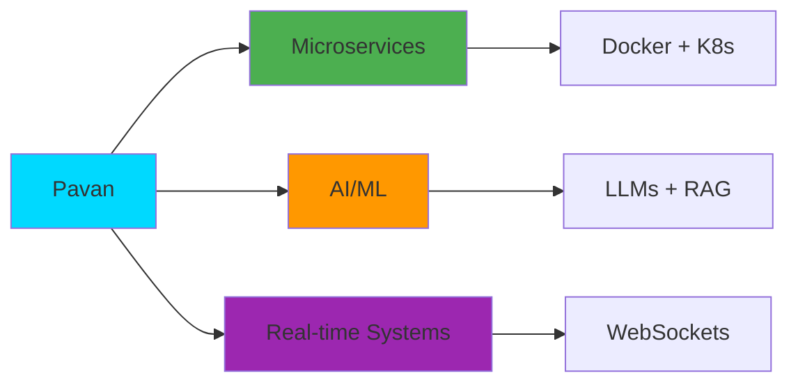

<div align="center">

# 👋 Hey, I'm Pavan Kumar


<p>
  <a href="https://linkedin.com/in/pavan-nani"></a>
  <a href="https://leetcode.com/u/pavankumarsimhadri987/"></a>
  <a href="https://codeforces.com/profile/pavanqwerty"></a>
</p>

```javascript
const pavan = {
    role: "Backend Lead @ Zordie AI",
    location: "Hyderabad, India 🇮🇳",
    currentlyBuilding: ["Adewin (AI AdTech)", "Investomation (Real Estate Analytics)"],
    focus: ["Microservices", "LLMs", "Scalable Systems"],
    achievements: [
        "🏆 Top 1% - Outlier AI Hackathon (500+ participants)",
        "🚀 Promoted to Backend Lead in 4 months",
        "💪 100+ LeetCode problems (85% medium/hard)",
        "🌟 1000+ LOC merged - GSSoC 2024"
    ]
};
```

</div>

---

## 🚀 What I'm Building

<table>
<tr>
<td width="50%">

### 🎨 Adewin - AI AdTech
**Co-Founder & Backend Architect**

```yaml
Tech: FastAPI, Python, PostgreSQL, GPT
Scale: Generates campaigns in minutes
Status: MVP ✅ Raising seed 💰
```

✨ LLM-powered ad generation  
⚡ Automated data workflows  
🎯 Built for SMBs

</td>
<td width="50%">

### 🏘️ Investomation - Real Estate AI
**Backend Developer**

```yaml
Tech: Svelte, Node.js, Express
Data: 300+ GB processed
Sources: Census, Zillow, Redfin
```

📊 Microservices architecture  
🔥 Real-time profiling  
💡 Neighborhood analytics

</td>
</tr>

<tr>
<td width="50%">

### 💬 EduConnect - Collab Platform
**Full-Stack Developer**

```yaml
Tech: React, Firebase, WebSockets
Users: 200+ concurrent
Latency: <200ms
```

⚡ Real-time chat  
🔒 JWT auth + RBAC  
📁 File sharing

</td>
<td width="50%">

### 🔬 FOSSEE @ IIT Bombay
**Research Intern**

```yaml
Tech: OpenFOAM, Python
Selection: Top 100/100+
Domain: CFD Simulations
```

🌊 Fluid dynamics  
🤖 Automation workflows  
🎓 Ongoing research

</td>
</tr>
</table>

---

## 💻 Tech Stack

<div align="center">

### Languages


### Frontend


### Backend


### Databases & Cloud


### AI/ML


</div>

---

## 📊 GitHub Stats

<div align="center">
  
  
</div>

<div align="center">
  
</div>

<div align="center">
  
</div>

---

## 🏆 Achievements

<div align="center">


</div>

<table>
<tr>
<td width="50%">

**💼 Professional**
- 🥇 Backend Lead @ Zordie AI (4-month promotion)
- 🚀 Co-founder @ Adewin (AI Startup)
- 📈 15+ APIs built, 45% performance gains
- ⚡ 60% faster load times achieved

</td>
<td width="50%">

**🎯 Competitive**
- 🏆 Top 1% - Outlier AI Hackathon (500+)
- 💪 100+ LeetCode (85% med/hard)
- 🌟 1000+ LOC merged - GSSoC 2024
- 🎓 IIT Bombay FOSSEE Research

</td>
</tr>
</table>

---

## 📈 Contribution Graph

<div align="center">


</div>

---

## 🎯 Current Focus



<table>
<tr>
<td width="33%">

### 🏗️ Architecture
- Microservices
- Event-driven systems
- API design
- Performance optimization

</td>
<td width="33%">

### 🤖 AI Integration
- LLMs (GPT, Claude)
- RAG systems
- Prompt engineering
- Vector databases

</td>
<td width="33%">

### ⚡ Performance
- Database optimization
- Caching strategies
- Load balancing
- Real-time systems

</td>
</tr>
</table>

---

## 💼 Experience Timeline

```yaml
2024-Present: Backend Lead @ Zordie AI
  - 15+ REST APIs serving 10K+ daily requests
  - 45% database query optimization
  - Microservices with Docker & PostgreSQL
  
2024: Full-Stack Developer @ Fairseat
  - Complete JWT authentication system
  - Real-time notifications with WebSockets
  - 40% API response time reduction

2023-2024: Full-Stack Developer @ DonClem
  - 60% faster load times (bundle optimization)
  - React + TailwindCSS components
  - Payment gateway integration
```

---

## 📫 Let's Connect!

<div align="center">

<a href="https://linkedin.com/in/pavan-nani">
  
</a>
<a href="mailto:your-email@example.com">
  
</a>
<a href="https://leetcode.com/u/pavankumarsimhadri987/">
  
</a>

### 💡 Open to opportunities in:
**Backend/Full-Stack Engineering** • **AI/ML Integration** • **Startup Ventures**


</div>

---

<div align="center">

### 💭 Random Dev Quote


### 😂 Dev Joke of the Day


---


</div>
